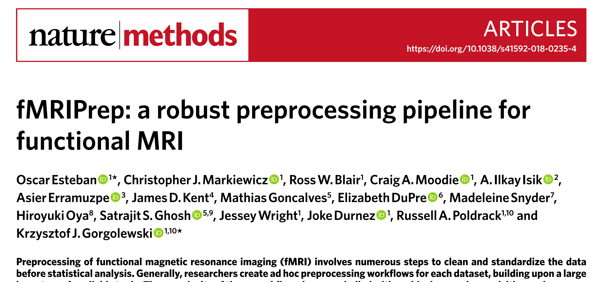

name: title
layout: true
class: center
---
layout: false
count: false

.middle.center[
# Building next-generation preprocessing pipelines:
# the *fMRIPrep* experience

<br />
<br />

### O. Esteban
#### Center for Reproducible Neuroscience
#### Stanford University

###### [www.nipreps.org](https://www.nipreps.org)
]

---
layout: false
count: false

.middle.center[
# Building next-generation preprocessing pipelines:
# the *fMRIPrep* experience

<br />
<br />

### O. Esteban
#### Center for Reproducible Neuroscience
#### Stanford University

###### [www.nipreps.org](https://www.nipreps.org)
]

???

I'm going to talk about how we are building a framework of preprocessing pipelines for neuroimaging called NiPreps, based on the fMRIPrep experience.
---
name: newsection
layout: true
class: section-separator

.perma-sidebar[
## TORW2020
### Talk 12
# NiPreps

<br />
<br />
<br />
<br />
<br />
<br />
<br />

<p align="center">

</p>
]

---
template: newsection
layout: false

.middle.center[
# Introducing *fMRIPrep*
]

???

Let's begin with some of the history behind fMRIPrep.

---
name: sidebar
layout: true

.perma-sidebar[
## TORW2020
### Talk 12
# NiPreps

<br />
<br />
<br />
<br />
<br />
<br />
<br />

<p align="center">

</p>
]

---
template: sidebar

### fMRIPrep produces analysis-ready data from acquired (fMRI) data
* minimal requirements ([BIDS-compliant](https://bids-standard.github.io/bids-validator/));
* *agnostic* to downstream steps of the workflow
  * produces [BIDS-Derivatives](https://bids-specification.readthedocs.io/en/stable/derivatives/introduction.html);

???

fMRIPrep takes in a task-based or resting-state
functional MRI dataset in BIDS-format
and returns preprocessed data ready for analysis.

Preprocessed data can be used for a broad range of analysis, and they are
formatted following BIDS-Derivatives to maximize compatibility with:
  * major software packages (AFNI, FSL, SPM\*, etc.)
  * further temporal filtering and denoising: *fMRIDenoise*
  * any BIDS-Derivatives compliant tool (e.g., *FitLins*).

--

### fMRIPrep is a [BIDS-App](https://bids-apps.github.io) ([Gorgolewski, et al. 2017](https://doi.org/10.1371/journal.pcbi.1005209))
* adhered to modern software-engineering standards (CI/CD, containers)
* compatible interface with other BIDS-Apps
* optimized for automatic execution

???

fMRIPrep adopts the BIDS-App specifications.
That means the software is tested with every change to the codebase,
it also means that packaging, containerization, and deployment are also
automated and require tests to be passing.
BIDS-Apps are inter-operable (via BIDS-Derivatives),
and optimized for execution in HPC, Cloud, etc.

--

### Minimizes human intervention
* avoid error-prone parameters settings (read them from BIDS)
* adapts the workflow to the actual data available
  * while remaining flexible to some design choices (e.g., whether or not reconstructing surfaces or customizing target normalized standard spaces)

???

fMRIPrep minimizes human intervention because the user does not
need to fiddle with any parameters - they are obtained from the BIDS structure.
However, fMRIPrep does allow some flexibility to ensure the preprocessing meets the requirements of the intended analyses.

--

### fMRIPrep bundles many tools (AFNI, FSL, FreeSurfer, Nilearn, etc.)
* (do not reinvent the wheel)

???

Finally, fMRIPrep sits on top of giants' shoulders:
AFNI, FSL, FreeSurfer, Nilearn, etc. all implement methods very well
backed-up and are thoroughly tested on their own.

---

### We started *fMRIPrep* in February 2016

<p align="center">

</p>

### Objectives:
* Develop an fMRI preprocessing tool enforcing BIDS for the inputs
* Automatically executable within OpenNeuro

### Initially inspired by *HCP Pipelines*
* Problem: robustness vs. the wide variability of inputs

???

We began working on fMRIPrep back in 2016 with much more humble expectations:
- We needed to develop an fMRI preprocessing tool leveraging BIDS - smart enough to adapt the workflow for the input dataset,
- and the tool should be executable in OpenNeuro without human intervention.

Please note that at the time, the BIDS-Apps specification didn't exist yet.

We started out with an eye on HCP Pipelines, and soon identified
that datasets in OpenNeuro varied extremely in terms of acquisition
protocols and imaging parameters, which is definitely not a problem
for HCP Pipelines, which has very specific requirements for the inputs.

---

## *fMRIPrep* adoption and popularization brought new challenges

.pull-right[
<p align="center">

</p>
]

???

With the fast adoption and popularization of *fMRIPrep*, new
challenges surfaced.

On the right-hand side, you'll find the chart of unique visitors
to fmriprep.org, which is the documentation website.

--

.pull-left[
#### Transparency was addressed with:

* the individual reports;
* the thorough documentation; and
* the *citation boilerplate*.
]

???

We realized that transparency is indeed a very hard problem.
The first leg of our solution was the creation of a solid report
system.
fMRIPrep generates one individual report per participant, containing
information not just to quality control the results, but also to
understand the processing flow.

We also strived for a comprehensive, thorough documentation.

Finally, the so-called citation boilerplate appended to the
individual reports describe the actual workflow that has been
run, noting all the software that was applied including their
versions and references.

--

.pull-left[
#### Run-to-run repeatability is an open issue:

* computational precautions (e.g., unpredictable float truncation/rounding)
* keep track of all random seeds (version +20.1)
]

???

Reproducibility in terms of run-to-run repeatability of results become as a more apparent problem, and we are always trying to minimize the vibration caused by computational factors, software versions, etc.

--

.pull-left[
#### Overwhelming feedback:

* massive amounts of bug reports, questioning the robustness
* organic emergence of *fMRIPrep enthusiasts* (thanks to E. DuPre, JD. Kent)
]

???

We always maintained close attention to all the feedback channels.
At some point we were washed over with bug reports that we needed to address.
We also started to doubt the robustness against the variability of inputs, and set a thorough stress-test plan using data from OpenNeuro (reported in our Nat Meth paper).
Among this feedback flooding, some external friends started to emerge and lent their shoulders in answering questions, fixing bugs, etc.

In particular, I want to thank Elizabeth DuPre (McGill) and James Kent (Univ. of Iowa) for being the earliest adopters and contributors.

---

## *fMRIPrep* is *stable* today, although unfinished

<div align="center" style='margin-top: 1em'>

</div>
([Esteban et al., 2019](https://doi.org/10.1038/s41592-018-0235-4))

???

These developments resulted in the following default processing workflow.

At the highest level, anatomical preprocessing (left-hand block)
and functional preprocessing (right-hand block) can be clearly
identified as the largest workflow units.

fMRIPrep combines all the anatomical images at the input in one anatomical
reference, removes the intensity non-uniformity, delineates brain tissues,
reconstructs surfaces, spatially normalizes the anatomical reference to
one or more standard spaces.

On the functional pathway, a reference is calculated for further processes,
then head-motion parameters are estimated (please note head-motion is accounted
for in the last resampling step, in combination with other transforms),
slice-timing correction is applied if requested.

Then, susceptibility distortion is estimated, if sufficient
information (in terms of acquisition and metadata) is found in the BIDS
structure.

Finally, data are mapped to the same individual's anatomical reference and
outputs in the several output spaces requested are generated, along with
a file gathering time-series of nuisance signals.

---

## The individual report

<video controls="controls" width="70%"
       name="Video Name" src="assets/fmriprep-report.mov"></video>

???

Let's walk through one example of report.
Reports have several sections, starting with a summary
indicating the particularities of this dataset
and workflow choices made based on the input data.

The anatomical section follows with several visualizations
to assess the anatomical processing steps mentioned before,
spatial normalization to template spaces (the flickering
panel helps assess alignment) and finally surface reconstruction.

Then, all functional runs are concatenated, and all show the same
structure.
After an initial summary of this particular run,
the alignment to the same subject's anatomical image is presented,
with contours of the white and pial surfaces as cues.
Next panel shows the brain mask and ROIs utilized by the CompCor
denoising.
For each run we then find some visualizations to assess the
generated confounding signals.

After all functional runs are presented, the About section keeps
information to aid reproducibility of results, such as the software's
version, or the exact command line run.

The boilerplate is found next, with a text version shown by default
and tabs to convert to Markdown and LaTeX.

Reports conclude with a list of encountered errors (if any).

---

## Reports are a crucial element to ensure transparency
.pull-left[
<p align="center">

</p>
]

.pull-right[

.distribute[
fMRIPrep generates one participant-wide report after execution.

Reports describe the data as found, and the steps applied
(providing .blue[visual support to look inside the box]):

  1. show researchers their data;

  2. show how *fMRIPrep* interpreted the data (describing the actual preprocessing steps);

  3. quality control of results, facilitating early error detection.
]
]

???

Therefore, reports have become a fundamental feature of fMRIPrep
because they not only allow assessing the quality of the processing,
but also provide an insight about the logic supporting such processing.

In other words, reports help respond to the what was done and the why was it done
in addition to the how well it did.

---

## Documentation as a second leg of transparency (fmriprep.org)

* Hackathons & docu-sprints

* the [CompCor documentation example](https://fmriprep.org/en/stable/outputs.html#confounds)

<p align="left">

</p>

.large[fmriprep.org]

???

We promptly identified the need for a very comprehensive documentation.
The website at fmriprep.org covers a substantial area of how the tool
works under the hood and how to best operate it.

The documentation turned out to be a great ice breaker for contributors,
who have pushed forward fundamental sections of it.

Most of the largest increments in documentation are the result of
discussions in hackathons, docusprints, neurostars, github, etc.
A hallmark example was pull request 1877 by Karolina Finc, who
gathered together a massive amount of knowledge from many contributors.
Now this is up and open in our documentation website.

---

## *fMRIPrep* is more of a community-driven project every day

* Bug-fixes: we ensured that open feedback channels were attended (GitHub, NeuroStars, mailing list, etc.);

* users began also proposing new features (some including code!);

* with *NiPreps* we are working towards handling the project over to the community.

???

To ensure the future sustainability of the project (what some developers call Bus factor),
we are transitioning the tool to *NiPreps*, transferring the large community nurtured over the past four years with it.

--

## How does *fMRIPrep* compensate its contributors?

* Contributors are invited to coauthor relevant publications about *fMRIPrep*.
* Anyone who helps with documentation, code or relevant discussions is a contributor.

.pull-left[
<p align="center">

</p>
]

.pull-right[
<p align="center">

</p>
]

???

In return, beyond the rewards of being part of an open source project, fMRIPrep gives
some scientific credit back in the form of publications.

- All contributors are invited to coauthor these publications.
- Anything that helps the project is considered a sufficient contribution.

---

## Lessons learned

### Researchers want to spend more time on those areas most relevant to them
(probably not preprocessing...)

???

With the development of fMRIPrep we understood that
researchers don't want to waste their time on preprocessing
(except for researchers developing new preprocessing techniques).

--

### Writing *fMRIPrep* required a team of several experts in processing methods for neuroimaging, with a solid base on Computer Science.
(research programs just can't cover the neuroscience and the engineering of the whole workflow - we need to divide the labor)

???

The current neuroimaging workflow requires extensive knowledge in
sometimes orthogonal fields such as neuroscience and computer science.
Dividing the labor in labs, communities or individuals with the necessary
expertise is the fundamental for the advance of the whole field.

--

### Transparency helps against the risk of super-easy tools
(easy-to-use tools are risky because they might get a researcher very far with no idea whatsoever of what they've done)

???

There is an implicit risk in making things too easy to operate:

For instance, imagine someone who runs fMRIPrep on diffusion data by
tricking the BIDS naming into an apparently functional MRI dataset.
If fMRIPrep reached the end at all, the garbage at the output could be fed into
further tools, in a sort of a snowballing problem.

When researchers have access to the guts of the software and are given an opportunity to understand what's going on, the risk of misuse dips.

--

### Established toolboxes do not have incentives for compatibility
(and to some extent this is not necessarily bad, as long as they are kept well-tested and they embrace/help-develop some minimal standards)

???

AFNI, ANTs, FSL, FreeSurfer, SPM, etc. have comprehensive software validation tests,
methodological validation tests, stress tests, etc. - which pushed up their quality and made them fundamental for the field.

Therefore, it is better to keep things that way (although some minimal efforts towards convergence in compatibility are of course welcome)

---

template: newsection
layout: false

.middle.center[
# www.nipreps.org

### (*NiPreps* == NeuroImaging PREProcessing toolS)

]

???

The enormous success of fMRIPrep led us to propose
its generalization to other MRI and non-MRI modalities,
as well as nonhuman species (for instance, rodents),
and particular populations currently unsupported by fMRIPrep
such as infants.

---

## Augmenting scanners to produce "*analysis-grade*" data
### (data *directly consumable* by analyses)

<br />
<br />

.pull-left[

***Analysis-grade* data** is an analogy to the concept of "*sushi-grade (or [sashimi-grade](https://en.wikipedia.org/wiki/Sashimi)) fish*" in that both are:

<br />

.large[**minimally preprocessed**,]

and

.large[**safe to consume** directly.]
]

.pull-right[

]

???

The goal, therefore, of NiPreps is to extend the scanner
so that, in a way, they produce data ready for analysis.

We liken these analysis-grade data to sushi-grade fish,
because in both cases the product is minimally preprocessed
and at the same time safe to consume as is.

---

template: newsection
layout: false

.middle.center[
# Deconstructing *fMRIPrep*

<br />


]

???

For the last two years we've been decomposing the architecture of fMRIPrep, spinning off its constituent parts that are valuable in other applications.

This process of decoupling (to use a proper CS term) has been greatly facilitated by the modular nature of the code since its inception.

---

<div align="center" style='margin-top: 1em'>

</div>

???

The processing elements extracted from fMRIPrep can be mapped to three
regimes of responsibility:

- Software infrastructure composed by tools ensuring the collaboration and the most basic tooling.
- Middleware utilities, which build more advanced tooling based on the foundational infrastructure
- And at the top of the stack end-user applications - namely fMRIPrep, dMRIPrep, sMRIPrep and MRIQC.

As we can see, the boundaries of these three architectural layers are soft and tools such as TemplateFlow may stand in between.

Only projects enclosed in the brain shape pertain to the NiPreps community. NiPype, NiBabel and BIDS are so deeply embedded as dependencies that NiPreps can't be understood without them.

---


* BIDS provides a standard, guaranteeing I/O agreements:

  * Allows workflows to self-adapt to the inputs
  * Ensures the shareability of the results

* PyBIDS: a Python tool to query BIDS datasets ([Yarkoni et al., 2019](https://doi.org/10.21105/joss.01294)):

  ``` Python
  >>> from bids import BIDSLayout

  # Point PyBIDS to the dataset's path
  >>> layout = BIDSLayout("/data/coolproject")

  # List the participant IDs of present subjects
  >>> layout.get_subjects()
  ['01', '02', '03', '04', '05']

  # List session identifiers, if present
  >>> layout.get_sessions()
  ['01', '02']

  # List functional MRI tasks
  >>> layout.get_tasks()
  ['rest', 'nback']
  ```

???

BIDS is one of the keys to success for fMRIPrep and consequently, a strategic element of NiPreps.

Because the tools so far are written in Python, PyBIDS is a powerful tool to index and query inputs and outputs.

The code snippet illustrates the ease to find out the subject identifiers available in the dataset, sessions, and tasks.

---

## BIDS Derivatives

.cut-right[
``` Shell
derivatives/
├── fmriprep/
│ ├── dataset_description.json
│ ├── logs
│ ├── sub-01.html
│ ├── sub-01/
│ │ ├── anat/
│ │ │ ├── sub-01_desc-brain_mask.nii.gz
│ │ │ ├── sub-01_dseg.nii.gz
│ │ │ ├── sub-01_label-GM_probseg.nii.gz
│ │ │ ├── sub-01_label-WM_probseg.nii.gz
│ │ │ ├── sub-01_label-CSF_probseg.nii.gz
│ │ │ ├── sub-01_desc-preproc_T1w.nii.gz
│ │ │ ├── sub-01_space-MNI152_desc-brain_mask.nii.gz
│ │ │ ├── sub-01_space-MNI152_dseg.nii.gz
│ │ │ ├── sub-01_space-MNI152_label-GM_probseg.nii.gz
│ │ │ ├── sub-01_space-MNI152_label-WM_probseg.nii.gz
│ │ │ ├── sub-01_space-MNI152_label-CSF_probseg.nii.gz
│ │ │ ├── sub-01_space-MNI152_desc-preproc_T1w.nii.gz
│ │ │ ├── sub-01_from-MNI152_to-T1w_mode-image_xfm.h5
│ │ │ ├── sub-01_from-T1w_to-MNI152_mode-image_xfm.h5
│ │ │ └── sub-01_from-orig_to-T1w_mode-image_xfm.txt
│ │ ├── figures/
│ │ └── func/
│ │   ├── sub-01_task-rhymejudgment_space-MNI152_boldref.nii.gz
│ │   ├── sub-01_task-rhymejudgment_space-MNI152_desc-preproc_bold.nii.gz
│ │   ├── sub-01_task-rhymejudgment_space-MNI152_desc-confounds_regressors.nii.gz
│ │   └── sub-01_task-rhymejudgment_space-MNI152_desc-brain_mask.nii.gz
```
]


???

All NiPreps must write out BIDS-Derivatives.
As illustrated in the example, the outputs of fMRIPrep are very similar to the BIDS standard for acquired data.

---

## BIDS-Apps

* BIDS-Apps proposes a workflow structure model:

  

* Use of containers & CI/CD

* Uniform interface:
  .cut-right[
  ```Shell
  fmriprep /data /data/derivatives/fmriprep-20.1.1 participant [+OPTIONS]
  ```
  ]

???

All end-user applications in NiPreps must conform to the BIDS-Apps specifications.

The BIDS-Apps paper identified a common pattern in neuroimaging studies, where individual participants (and runs) are processed first individually, and then based on the outcomes, further levels of data aggregation are executed.

For this reason, BIDS-Apps define two major levels of execution: participant and group level.

Finally, the paper also stresses the importance of containerizing applications to ensure long-term preservation of run-to-run repeatability and proposes a common command line interface as described at the bottom:


- first the name of the BIDS-Apps (fmriprep, in this case)
- followed by input and output directories (respectively),
- to finally indicate the analysis level (always participant, for the case of fmriprep)

---

.pull-left[
<p align="center">

</p>
<br />

``` Python
from nipype.interfaces.fsl import BET
brain_extract = BET(
  in_file="/data/coolproject/sub-01/ses-01/anat/sub-01_ses-01_T1w.nii",
  out_file="/out/sub-01/ses-01/anat/sub-01_ses-01_desc-brain_T1w.nii"
)
brain_extract.run()
```

Nipype is the gateway to mix-and-match from AFNI, ANTs, Dipy, FreeSurfer, FSL, MRTrix, SPM, etc.
]

.pull-right[
<p align="center">

</p>
]


???

Nipype is the glue stitching together all the underlying neuroimaging toolboxes and provides the execution framework.

The snippet shows how the widely known BET tool from FSL can be executed using NiPype. This is a particular example instance of interfaces - which provide uniform access to the tooling with Python.

Finally, combining these interfaces we generate processing workflows to fulfill higher level processing tasks.

---


<p align="center">

</p>

???

For instance, we may have a look into fMRIPrep's functional processing block.

Nipype helps understand (and opens windows in the black box) generating these graph representation of the workflow.

---


``` Python
"""Fix the affine of a rodent dataset, imposing 0.2x0.2x0.2 [mm]."""
import numpy as np
import nibabel as nb

# Open the file
img = nb.load("sub-25_MGE_MouseBrain_3D_MGE_150.nii.gz")

# New (correct) affine
aff = np.diag((-0.2, -0.2, 0.2, 1.0))

# Use nibabel to reorient to canonical
card = nb.as_closest_canonical(nb.Nifti1Image(
    img.dataobj,
    np.diag((-0.2, -0.2, 0.2, 1.0)),
    None
))

# Save to disk
card.to_filename("sub-25_T2star.nii.gz")
```

???

NiBabel allows Python to easily access neuroimaging data formats such as NIfTI, GIFTI and CIFTI2.

Although this might be a trivial task, the proliferation of neuroimaging software has led to some sort of Wild West of formats, and sometimes interoperation is not ensured.

In the snippet, we can see how we can manipulate the orientation headers of a NIfTI volume, in particular a rodent image with incorrect affine information.
---

.pull-left[
<p align="center">

</p>
<br />
<br />

Transforms typically are the outcome of image registration methodologies

<br />

The proliferation of software implementations of image registration methodologies has resulted in a spread of data structures and file formats used to preserve and communicate transforms.

([Esteban et al., 2020](https://doi.org/10.1109/ISBI45749.2020.9098466))
]

.pull-right[
<p align="center">

</p>
]


???

NiTransforms is a super-interesting toy project where we are exercising our finest coding skills.
It completes NiBabel in the effort of making spatial transforms calculated by neuroimaging software tools interoperable.

When it goes beyond the alpha state, it is expected to be merged into NiBabel.

At the moment, NiTransforms is already integrated in fMRIPrep +20.1
to concatenate LTA (linear affine transforms) transforms obtained with FreeSurfer,
ITK transforms obtained with ANTs, and motion parameters estimated with FSL.

Compatibility across formats is hard due to the many arbitrary decisions in establishing the mathematical framework of the transform and the intrinsic confusion of applying a transform.

While intuitively we understand applying a transform as "transforming the moving image so that I can represent it overlaid or fused with the reference image and both should look aligned", in reality, we only transform coordinates from the reference image into the moving image's space (step 1 on the right).

Once we know where the center of every voxel of the reference image falls in the moving image coordinate system, we read in the information (in other words, a value) from the moving image. Because the location will probably be off-grid, we interpolate such a value from the neighboring voxels (step 2).

Finally (step 3) we generate a new image object with the structure of the reference image and the data interpolated from the moving information. This new image object is the moving image "moved" on to the reference image space and thus, both look aligned.

---

.pull-left[
<p align="center">

</p>


* The Archive (right) is a repository of templates and atlases
* The Python Client (bottom) provides easy access (with lazy-loading) to the Archive

``` Python
>>> from templateflow import api as tflow
>>> tflow.get(
...     'MNI152NLin6Asym',
...     desc=None,
...     resolution=1,
...     suffix='T1w',
...     extension='nii.gz'
... )
PosixPath('/templateflow_home/tpl-MNI152NLin6Asym/tpl-MNI152NLin6Asym_res-01_T1w.nii.gz')
```

.large[www.templateflow.org]
]

.pull-right[
<p align="center">

</p>
]

???

One of the most ancient feature requests received from fMRIPrep early adopters was improving the flexibility of spatial normalization to standard templates other than fMRIPrep's default.

For instance, infant templates.

TemplateFlow offers an Archive of templates where they are stored, maintained and re-distributed;

and a Python client that helps accessing them.

On the right hand side, an screenshot of the TemplateFlow browser shows some of the templates currently available in the repository. The browser can be reached at www.templateflow.org.


The tool is based on PyBIDS, and the snippet will surely remind you of it.
In this case the example shows how to obtain the T1w template corresponding to FSL's MNI space, at the highest resolution.

If the files requested are not in TemplateFlow's cache, they will be pulled down and kept for further utilization.

---

## TemplateFlow - Archive
<p align="center">

</p>
.small[(Ciric et al. 2020, in prep)]

???

The Archive allows a rich range of data and metadata to be stored with the template.

Datatypes in the repository cover:

- images containing population-average templates,
- masks (for instance brain masks),
- atlases (including parcellations and segmentations)
- transform files between templates

Metadata can be stored with the usual BIDS options.

Finally, templates allow having multiple cohorts, in a similar encoding to that of multi-session BIDS datasets.

Multiple cohorts are useful, for instance, in infant templates with averages at several gestational ages.


---


<br />
<br />

NiWorkflows is a miscellaneous mixture of tooling used by downstream *NiPreps*:

???

NiWorkflows is, historically, the first component detached from fMRIPrep.

For that reason, its scope and vision has very fuzzy boundaries as compared to the other tools.

The most relevant utilities incorporated within NiWorkflows are:

--

* The reportlet aggregation and individual report generation system

???

First, the individual report system which aggregates the visual elements or the reports (which we call "reportlets") and generates the final HTML document.

Also, most of the engineering behind the generation of these reportlets and their integration within NiPype are part of NiWorkflows

--

* Custom extensions to NiPype interfaces

???

Beyond the extension of NiPype to generate a reportlet from any given interface, NiWorkflows is the test bed for many utilities that are then upstreamed to nipype.

Also, special interfaces with a limited scope that should not be included in nipype are maintained here.

--

* Workflows useful across applications

???

Finally, NiWorkflows indeed offers workflows that can be used by end-user NiPreps. For instance atlas-based brain extraction of anatomical images, based on ANTs.

---


<object style="width: 75%;" type="image/svg+xml" data="assets/sub-100068_task-machinegame_run-6_desc-sdc_bold.svg"></object>

???

Echo-planar imaging (EPI) are typically affected by distortions along the phase encoding axis, caused by the perturbation of the magnetic field at tissue interfaces.

Looking at the reportlet, we can see how in the "before" panel, the image is warped.

The distortion is most obvious in the coronal view (middle row) because this image has posterior-anterior phase encoding.

Focusing on the changes between "before" and "after" correction in this coronal view, we can see how the blue contours delineating the corpus callosum fit better the dark shade in the data after correction.

---

## SDCFlows, as integrated in *fMRIPrep*


.left-column3[
<p align="center">

</p>
]

.right-column3[
* Hierarchy of SDC methods:
  1. PE-Polar
  2. Fieldmap
  3. Fieldmap-less


* Arguments:
  * `--use-syn-sdc`
  * `--force-syn`
  * `--ignore fieldmaps`


* REQUIRES (opts. 1 or 2): setting the [`IntendedFor`](https://bids-specification.readthedocs.io/en/latest/04-modality-specific-files/01-magnetic-resonance-imaging-data.html#fieldmap-data) metadata field of fieldmaps.
]


???

With SDCFlows, fMRIPrep implements a rather sophisticated pipeline for the estimation of susceptibility distortions.

Depending on whether the input dataset contains EPI images with opposed phase encoding polarities (the so-called PE-Polar correction), fieldmaps (as Gradient Recalled Echo sequences) or the fieldmap-less estimation is requested,

then SDCFlows establishes a hierarchy of corrections.

After correction, we are interested in assessing that low-frequency distortions have been accounted for and that high-frequency (with extreme regions suffering severe drop-outs) are not excessively present.

---
.pull-left[
<p align="center">

</p>
]
.pull-right[
<p align="center">

</p>
]

???

sMRIPrep corresponds to the split of the anatomical preprocessing
workflow originally proposed with fMRIPrep.

With the support of TemplateFlow, the tool now supports spatial normalization to one or more templates found in the TemplateFlow Archive.

It also supports the use of custom templates, whenever they are correctly installed in the templateflow's cache folder.

---

<br />
<p align="center">

</p>

<br />
<br />

<p align="center">

</p>

???

dMRIPrep and fMRIPrep are, of course the tip of the iceberg.

dMRIPrep is still in an alpha state, steadily progressing through the path fMRIPrep has delineated for NiPreps.

Hopefully, at this point of the talk fMRIPrep doesn't need further description.

---

template: newsection
layout: false

.middle.center[
# Other components of NiPreps
]

???

Some additional components of NiPreps were never part of fMRIPrep's codebase, or they have been started recently.

---

<p align="center">

</p>
<br />
<p align="center">

</p>
<br />
<p align="center">

</p>

???

Such is the case of the quality control tools.

MRIQC produces visual reports for the efficient screening of acquired (meaning, unprocessed) data - in particular anatomical and functional MRI of the human brain.

CrowdMRI is an internet service where anonymized quality control metrics are uploaded automatically as they are computed by MRIQC.

The endgoal is to gather enough data to describe the normative distribution of these metrics across image parameters and scanning devices and sites.

Finally, MRIQCnets encloses several machine learning projects regarding the quality of acquired images.

---

## Upcoming new utilities

### NiBabies

* Recently started, covering infant MRI brain-extraction for now (Mathias Goncalves)

### NiRodents

* Recently started, covering rodent MRI brain-extraction for now (Eilidh MacNicol)


???

So, what's coming up next?

NiBabies is some sort of NiWorkflows equivalent for the preprocessing of infant imaging. At the moment, only atlas-based brain extraction using ANTs (and adapted from NiWorkflows) is in active developments.

Next steps include brain tissue segmentation.

Similarly, NiRodents is the NiWorkflows parallel for the prepocessing of rodent preclinical imaging. Again, only atlas-based brain extraction adapted from NiWorkflows is being developed.

--

## Future lines

* fMRIPrep-babies

* fMRIPrep-rodents

* MolPrep / PETPrep ?

???

In a mid-term future, both NiBabies and NiRodents should allow the extension of fMRIPrep to these new two idiosyncratic data families.

In additions, plans for a molecular imaging or PET preprocessing NiPrep are being designed.

---

## Conclusion

### *NiPreps* is a framework for the development of preprocessing workflows

* Principled design, with BIDS as an strategic component
* Leveraging existing, widely used software
* Using NiPype as a foundation

???

To wrap-up, I've presented NiPreps, a framework for developing preprocessing
workflows inspired by fMRIPrep.

The framework is heavily principle and tags along BIDS as a foundational component

NiPreps should not reinvent any wheel, trying to reuse as much as possible of the widely used and tested existing software.

Nipype serves as a glue components to orchestrate workflows.

--

### Why preprocessing?

* We propose to consider preprocessing as part of the image acquisition and reconstruction
* When setting the boundaries that way, it seems sensible to pursue some standardization in the preprocessing:
  * Less experimental degrees of freedom for the researcher
  * Researchers can focus on the analysis
  * More homogeneous data at the output (e.g., for machine learning)
* How:
  * Transparency is key to success: individual reports and documentation (open source is implicit).
  * Best engineering practices (e.g., containers and CI/CD)

???

But why just preprocessing, with a very strict scope?

We propose to think about preprocessing as part of the image acquisition and reconstruction process (in other words, scanning), rather than part of the analysis workflow.

This decoupling from analysis comes with several upshots:

First, there are less moving parts to play with for researchers in the attempt to fit their methods to the data (instead of fitting data with their methods).

Second, such division of labor allows the researcher to use their time in the analysis.

Finally, two preprocessed datasets from two different studies and scanning sites should be more homogeneous when processed with the same instruments, in comparison to processing them with idiosyncratic, lab-managed, preprocessing workflows.

However, for NiPreps to work we need to make sure the tools are transparent.

Not just with the individual reports and thorough documentation, also because of the community driven development. For instance, the peer-review process that goes around large incremental changes is fundamental to ensure the quality of the tool.

In addition, best engineering practices suggested in the BIDS-Apps paper, along with those we have been including with fMRIPrep, are necessary to ensure the quality of the final product.

--

### Challenges

* Testing / Validation!

???

As an open problem, validating the results of the tool remains extremely challenging for the lack in gold standard datasets that can tell us the best possible outcome.

---

template: newsection
layout: false

.middle.center[
# Open PhD student position!
]

---

template: newsection
layout: false

.middle.center[
# Thanks!

## Questions?
]
