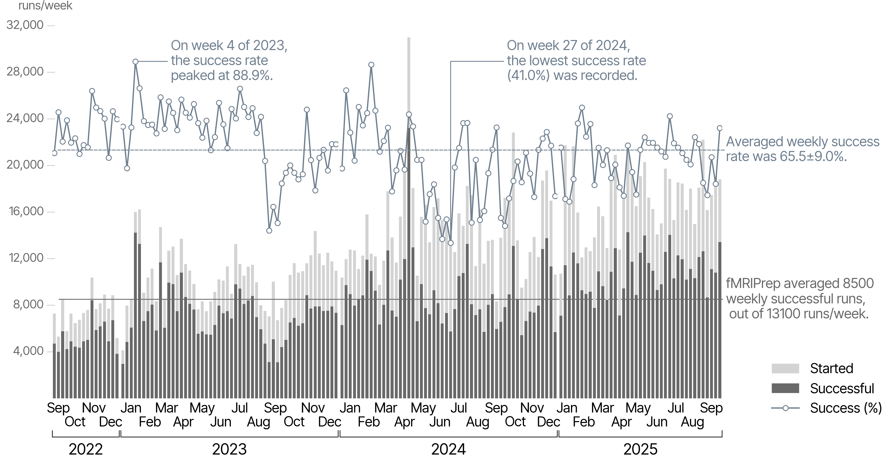
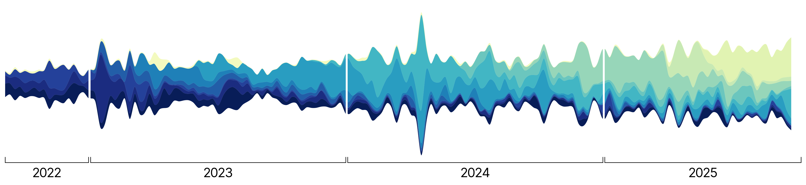

# NeuroImaging PREProcessing toolS (NiPreps)

*NiPreps* **augment the scanner to produce data *directly consumable* by analyses**.

We refer to data *directly consumable by analyses* as ***analysis-grade data*** by analogy with the concept of "*sushi-grade (or [sashimi-grade](https://en.wikipedia.org/wiki/Sashimi)) fish*" in that both are products that have been:

  * **minimally preprocessed**, but are
  * **safe to consume** directly.

 

## Building on the success story of *fMRIPrep*

*NiPreps* were conceived as a generalization of *fMRIPrep* across new modalities, populations, cohorts, and species.
*fMRIPrep* is widely adopted, as our telemetry with Sentry (and now, *in-house* with [migas](https://github.com/nipreps/migas-py)) shows:

|  |
|:--:|
| *fMRIPrep* is executed an average of 11,800 times every week, of which, around 7,800 times it finishes successfully (66.2% success rate). The average number of executions started includes debug and *dry* runs where researchers do not intend actually process data. Therefore, the *effective* (that is, discarding test runs) success ratio of *fMRIPrep* is likely higher. |

|  |
|:--:|
| Streamplot of *fMRIPrep*'s version adoption. |
