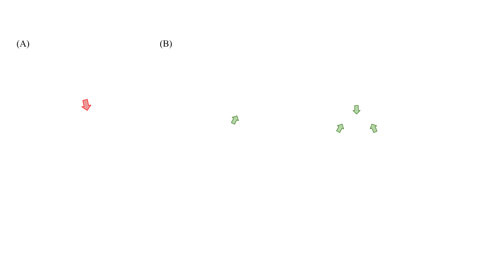
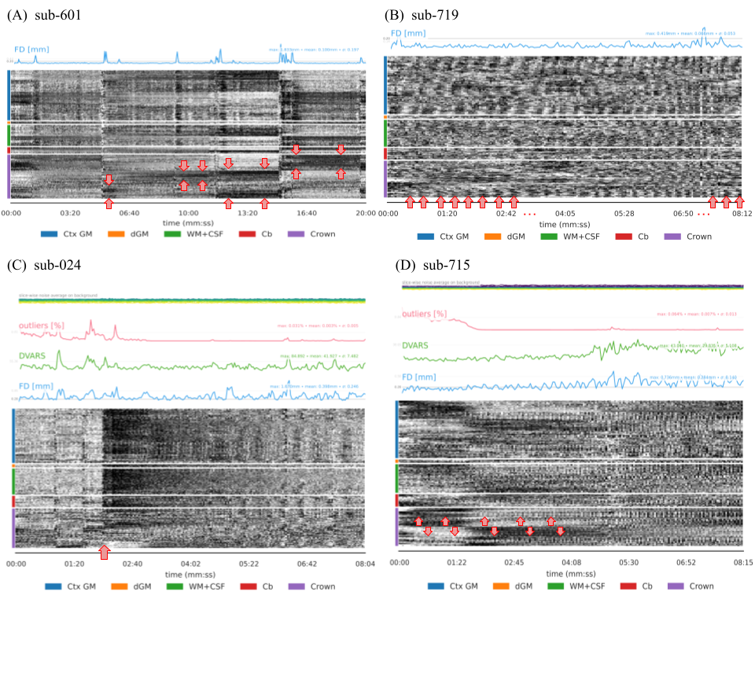

# How To Read fMRIPrep visual Report

fMRIPrep generates HTML visual reports that allow you to check the results of the preprocessing steps that were applied to the data. 
Note: this is not a replacement for running quality control of your images before running fMRIPrep (FAQ link: https://fmriprep.readthedocs.io/en/stable/faq.html). 
Below is a guide to interpreting the information contained in the visual reports, organized by subsection of the report.

If you have examples of “bad” preprocessing results that you’re willing to share, please [submit them somewhere?] with a short description of the problem (for example, “bad skull stripping”).

When you open a report, it may be helpful to first jump to the Errors subsection to see whether fMRIPrep encountered any errors during preprocessing. Note that “errors” refers only to problems in running fMRIPrep, and NOT problems with the quality of the resulting images. This section won’t flag participants in which fMRIPrep was able to successfully run to completion but yielded poor results. 

## **Summary**

The first section of the report is a text summary, containing the subject ID, number of structural and functional images, task name, output spaces in which fMRIPrep generated your preprocessed data, and whether surface reconstruction with Freesurfer was run. 
It is good to check that all of this information is as expected.

## **Anatomical**

The reports first present results of anatomical preprocessing. 

### Anatomical conformation

* This section provides information about the structural images.
* Check for obvious failures, such as missing images or implausible values for voxel size, orientation, or dimensions.
    * For example: you’re expecting two input T1w images but it says “Input T1w images: 1”

### Brain mask and brain tissue segmentation of the T1w

This report displays the brain mask and the brain tissue segmentation computed from the T1w image. It shows the quality of intensity non-uniformity (INU) correction, skull stripping, and tissue segmentation.

* INU correction
    * Good:
        * The intensity of the image is uniform throughout the brain
    * Bad:
        * Intensity non-uniformity artifacts (looks like the “original image” panel in Figure 1):
 
         
        *Figure 1. from Vovk, U., Pernus, F., & Likar, B. (2007). A review of methods for correction of intensity inhomogeneity in MRI. IEEE transactions on medical imaging, 26(3), 405-421.*

* Skull stripping
    * Good:
        * The brain mask (red) covers the whole brain and only the brain - not the dura or anything else outside the brain. It should closely follow the contour of the brain.

    * Bad:
        * Skull-stripping failed leading to an inaccurate brain mask
            * The brain mask cuts off part of the brain and/or contains holes surrounding signal drop-out regions.
            * The brain mask includes parts that are clearly NOT brain.
                * For example, fMRIPrep might have misclassified part of the dura, epidural space, or skull as belonging inside the brain mask; as a result the brain mask presents “bumps” surrounding high-intensity areas of signal outside of the cortex. 

            * Having an accurate brain mask makes the downstream preprocessing of an fMRI scan faster (excluding voxels of non-interest) and more accurate (less bias from voxels of non-interest). Consequently, it is important to discard subjects for which the brain mask is not well defined.

* Tissue segmentation
    * Good:
        * The outlines of the gray matter (GM; magenta) and white matter (WM; blue) segmentation are correctly drawn. The blue line should follow the boundary between GM and WM, while the magenta line should outline ventricles.

    * Bad:
        * The GM (magenta)/WM (blue) outlines don’t match where those tissue classes are distributed in the underlying image, so either the blue line does not follow the boundary between GM and WM or the magenta line does not outline ventricles.
        * Inclusion of tissues other than the tissue of interest in the contour delineations should lead to exclusion of the scan.
        * T1w scans showcasing a low signal-to-noise ratio because of thermal noise will present scattered misclassified voxels within piecewise-smooth regions (generally more identifiable in the WM and inside the ventricles). 
            * These scans should be excluded except for images where these voxels are only present at subcortical structures (e.g., thalamus) or nearby tissue boundaries. In the latter case, the misclassification results from partial volume effects (i.e., indeed, such voxels contain varying fractions of two or more tissues). The figure below illustrates the difference between individual dots caused by noise versus partial volume effects.
             
            *Figure 2. Error in brain tissue segmentation of T1w images. (A) The presence of noise compromises the segmentation leading to single voxels being excluded from the ventricle mask. The subject has thus been excluded from further analysis. (B) A series of spots are visible at the boundary between GM and WM. Those spots are due to partial volume effect and thus is a flaw of the fMRIPrep segmentation implementation not of the image quality.*

* Common pitfalls in interpretation:
    * At the inter-hemispheric space, masks (and in particular the brain mask, despite its smooth edges) may intersect the visualization plane several times, giving the impression that the mask is cutting off brain regions. However, this is more of a visual effect on the cutting plane.
    * Note that the brain mask plotted in the “brain mask and (anatomical/temporal) CompCor ROIs” panel under the functional section is computed from the BOLD image and thus is not identical to the brain mask mentioned in this paragraph. Hence, they follow different exclusion criteria.

### Spatial normalization of the anatomical T1w reference

The normalization report shows how successfully your T1w image(s) were resampled into standard space, for each of the template spaces used.
* Good:
    * Your T1w image and the template image line up well when you toggle between the images (hover mouse over the panel):
        * In order of importance, the following structures should be correctly aligned : 1. ventricles, 2. subcortical regions, 3. corpus callosum, 4. cerebellum, 5. cortical gray matter.
        * The standard templates provided with fMRIPrep (such as `MNI152NLin2009cAsym`) are averaged across multiple subjects, so the template image will look blurrier than the T1w image. Because of this averaging, it is normal for sulci to be less pronounced and gyri to be wider on the template than the T1w image.

* Bad:
    * Stretching or distortion in the participant’s T1w image, indicating failed normalization.
        * A misalignment of the ventricles, the subcortical regions, or the corpus callosum should lead to immediate exclusion. You can however be more lenient with the misalignment of cortical GM because volumetric (image) registration may not resolve substantial inter-individual differences (e.g., a sulcus missing in an individual’s brain but typically present in the population of the template).

    * If skull-stripping was not successful, you might see some places where there are non-brain voxels outside of the contours of the brain. 

### Surface reconstruction

If you used the `--fs-no-reconall` flag to skip surface-based preprocessing, this section of the report will not exist.
The FreeSurfer [fischl2012][1] subject reconstruction report shows the WM (blue outline) and pial (red outline) surfaces overlaid on the T1w image.
* Good:
    * The white-gray boundary outlined (blue link) matches the underlying image.
    * WM and pial surface boundary outlines do not cross or overlap each other.

* Bad:
    * The white-gray boundary outline (blue line) does not correspond well to the boundary observed in the underlying image.
    * WM and pial surface boundaries cross or overlap each other.
    * Pial surface (red outline) extends past the actual pial boundary (see images [here](https://surfer.nmr.mgh.harvard.edu/fswiki/FsTutorial/PialEdits_tktools) for an example ; this can be a result of bad skull-stripping).
    * QC assessment of FreeSurfer outcomes is comprehensively covered elsewhere (e.g., White et al. 2018 [white2018][2]; Klapwijk et al. 2019 [klapwijk2019][3]), and fMRI studies using vertex-wise (surface) analyses should rigorously assess these surfaces. 
    * In a voxel-wise analysis, data should be excluded only when the reconstructed surfaces are extremely inaccurate, which typically only happens in the presence of artifacts easily captured previously by [MRIQC](https://mriqc.readthedocs.io/en/latest/).

* Common pitfalls in interpretation:
    * Note that cerebellum and brainstem are excluded from the surface reconstruction in fMRIPrep; it is thus normal that the outlines do not include these areas.

## **Functional**

### Textual summary

* The BOLD summary describes the interpretation of the inputs by fMRIPrep, and the applied heuristics. For instance, if the dataset is multi-echo EPI and comprehends three or more echos, then fMRIPrep should indicate this in the BOLD summary.

* Other potential issues are missing images or implausible values.
    * Functional data can vary based on available data, metadata, user selections.
        * What does “Heuristics - BBR may fall back to volume-based coregistration” mean?

            In fMRIPrep’s workflow, if boundary-based registration fails (meaning that `bbr` distorts the affine registration more than 15mm), fMRIPrep reverts to using the initial affine transform from Freesurfer’s `mri_coreg` tool instead of using the bbr refinement of the initial transform ([relevant code](https://github.com/nipreps/fmriprep/pull/694/files#diff-939042e0a10e509ce5708c3e112376ffR29)) 

    * “Note on orientation: qform matrix overwritten/ this data has been copied from sform/sform matrix set” warnings

        `qform` and `sform` refer to metadata fields in the NIfTI file header, prescribing a coordinate system for the image. 
        This message warns you that information in the header was altered during the preprocessing.
        This is an advisory message and does not necessarily indicate issues in data quality or registration.
        A common scenario is that the sform code was 0, so fMRIPrep copied the code from qform in order to keep the affine matrices aligned, ensuring that the images will be treated as having the same orientation later down the pipeline.
        See Chris Markewicz’s Neurostars posts [here](https://neurostars.org/t/note-on-orientation-qform-and-sform-warning/4379/4) and [here](https://neurostars.org/t/note-on-orientation-sform-matrix-set/5939) for a longer explanation of when/why fMRIPrep produces these warnings. You can read more about how `qform` and `sform` work at the following links: [Recommended usage of qform and sform](https://nifti.nimh.nih.gov/nifti-1/documentation/nifti1fields/nifti1fields_pages/qsform_brief_usage) and [Nifti Qform and Sform](http://gru.stanford.edu/doku.php/mrTools/coordinateTransforms). 
 
### Alignment of functional and anatomical data

The alignment report shows the quality of co-registration and susceptibility distortion correction.

* Co-registration
    * The text tells you which method fMRIPrep used to align the functional and anatomical data - for example, by running `bbregister`. The images show the registered BOLD reference with the white and pial surfaces overlaid (red and blue lines)
    * Good:
        * The BOLD and T1w images are aligned; image boundaries and anatomical landmarks (for example, ventricles; corpus callosum) appear to be in the same place when toggling between the images.
        * White and pial surface outlines (red and blue lines) appear to correspond well to the tissue boundaries in the functional images. 

    * Bad:
        * Functional and anatomical images are not aligned and clearly differ in their spatial location or orientation.
        * White and pial surface boundaries (red and blue lines) overlays correspond poorly to the tissue boundaries in the underlying images.

* Susceptibility distortion correction
    * The functional images can have some warping or distortion due to inhomogeneities in the $B_0$ magnetic field. For more details on what causes susceptibility distortion, refer to [the educational notebook of SDCFlows](https://github.com/nipreps/sdcflows/blob/master/docs/notebooks/SDC%20-%20Theory%20and%20physics.ipynb). Susceptibility distortion artifacts manifest in two different ways on the functional and structural images: as signal drop-out, that is, a region where the signal vanishes, or as brain distortions. Signal drop-outs often appear close to brain-air interfaces; these include ventromedial prefrontal cortex, the anterior part of the prefrontal cortex, and the region next to the ear cavities. 
    * Good:
        * No signal drop out or brain distortion affects your region of interest.
        * The pial surface  outlines (blue lines) appear to correspond well to the tissue boundaries in the functional images.
    * Bad:
        * If the susceptibility distortion correction is unsuccessfull, residual susceptibility distortion artifacts can be observed. If the latter overlaps with regions of interest, the scan should be excluded.
        * Note however that some drop out in inferior brain regions (such as the OFC or medial temporal lobe) in functional images is somewhat inevitable. Depending on the type of analysis you’re doing and what you’re interested in, this may be more/less of an issue for you. If you see a lot of signal drop out, you will probably want to check the brain mask generated by fMRIPrep to see how that drop-out impacts the location and quantity of missing voxels in your brain mask.
        
* Common pitfalls in interpretation:
    * Note that the BOLD images displayed in the report may have what appears to be an “artifact” in the data, as shown below. This is because the reports use a faster but less precise type of interpolation (Nearest Neighbor interpolation) for display. In actuality, fMRIPrep uses Lanczos interpolation for resampling, so these apparent “artifacts” are not present in the actual data (you can confirm this by checking the preprocessed BOLD NIFTI file and its registration to the T1w image in your preferred software). 

        
        *Figure 3. The use of a fast interpolation for display can lead to artifact-like structure that are not present in the actual data.*

### Brain mask and temporal/anatomical CompCor ROIs

This report shows the brain mask calculated on the BOLD signal (red contour), along with the regions of interest (ROIs) used by CompCor [behzadi2017][4] for the estimation of physiological and movement confounding components. The user can then choose those components as nuisance regressors in analysis. 

The anatomical CompCor ROI (magenta contour) is a mask combining cerebrospinal fluid (CSF) and WM, where voxels containing a minimal partial volume of GM have been removed. It represents a mask of region of no interest.

The temporal CompCor ROI (blue contour) contains the top 2% most variable voxels within the brain mask.

The brain edge (or crown) ROI (green contour) picks signals outside but close to the brain, which are decomposed into 24 principal components.

* Good:
    * The brain mask correctly surrounds the brain boundary, not leaving out brain area. Note that holes in the brain mask such as on Figure 4, is not problematic as it should not disrupt co-registration.
    
    *Figure 4. Such holes in the brain mask is not problematic as it should not disrupt co-registration.*

* Bad:
    * The brain mask computed from the BOLD image mainly influences confounds estimation, but also co-registration, although the latter is primarily driven by the WM mask. As such the brain mask must not leave out any brain area, but it can be a bit loose around the brain. If the mask intersects with brain-originating signal, the nuisance regressors should not be used.
    * If the study plan prescribes using CompCor or brain-edge regressors, it is critical to exclude BOLD runs where any of these masks substantially overlap regions of interest.
    * The shape and the large overlap of the tCompCor with region of interest can also indicate the presence of an artifact that was missed in the other visualizations (e.g see Figure 5). In this case, the scan should be excluded. 
    
    *Figure 5. The shape and the large overlap of the tCompCor with region of interest indicates the presence of an artifact that was missed in the other visualizations.*  

### Variance explained by t/a CompCor components

The figure displays the cumulative variance explained by components for each of four CompCor decompositions (left to right: anatomical CSF mask, anatomical white matter mask, anatomical combined mask, temporal). Dotted lines indicate the minimum number of components necessary to explain 50%, 70%, and 90% of the variance in the nuisance mask. By default, only the components that explain the top 50% of the variance are saved. The number of components that must be included in the model in order to explain some fraction of variance in the decomposition mask can be used as a feature selection criterion for confound regression.
 
### BOLD summary

The BOLD summary report shows several characteristic statistics along with a carpet plot [power2017][5], giving a view of the temporal characteristics of the preprocessed BOLD series. The carpet plot is a tool to visualize changes in voxel intensities throughout an fMRI scan. It works by plotting voxel time series in close spatial proximity so that the eye notes temporal coincidence. One particular innovation of this carpet plot implementation is that it contains the "crown" area corresponding to voxels located on a closed band around the brain's outer edge [patriat2015][6]. As those voxels are outside the brain, we do not expect any signal there, meaning that the presence of signal can be interpreted as produced by an artifact.
* Definitions: 
    * GS - global signal calculated in the whole-brain show the mean BOLD signal in the corresponding mask.
    * GSCSF - global signal calculated within cerebrospinal fluid (CSF)
    * GSWM - global signal calculated within white matter (WM)
    * DVARS - [*standardized DVARS!*](https://neurostars.org/t/fmriprep-standardised-dvars/5271) for each time point
    * FD - framewise-displacement measures for each time point

* Good:
    * The carpet plot is homogeneous, particularly in the edge.

* Bad:
    * Strongly structured crown region in the carpet plot is a sign that artifacts are compromising the fMRI scan [provins2022][7]. Several types of carpet plot modulations can be differentiated and are illustrated in the figure below.
        * Motion outbursts, visible as peaks in the FD trace, are often paired with prolonged dark deflections derived from spin-history effects (see Figure 6A). 
        * Periodic modulations on the carpet plot indicate regular and slow motion, e.g., caused by respiration, which may also compromise the signal of interest (see Figure 6B). 
        * Coil failures may be identifiable as a sudden change in overall signal intensity on the carpet plot not paired that is not paired with motion peaks and generally sustained through the end of the scan (see Figure 6C). 
        * A strong polarized structure revealed by the clustering of carpet plot rows suggests that artifacts mitigate the signal of interest (see Figure 6D). Indeed, sorting the rows (i.e., the time series) of each segment of the carpet plot such that voxels with similar BOLD dynamics appear close to one another reveals non-global structure in the signal, which is obscured when voxels are ordered randomly [aquino2020][8].
        * Finding temporal patterns similar in gray matter areas and simultaneously in regions of no interest (for instance, CSF or the crown) indicates the presence of artifacts, typically derived from head motion. If the planned analysis specifies noise regression techniques based on information from these regions of no interest (which is standard and recommended [ciric2017][9]), the risk of removing signals with neural origins is high, and affected scans should be excluded. 

    
    *Figure 6. Assessment of time series with the carpet plot. The crown region of the carpet plot comprises voxels outside the brain. As such, structure in the crown can be interpreted as artifactual, and thus corresponds to an exclusion criteria. (A) Motion outbursts, visible as peaks in the framewise displacement (FD) trace, are often paired with prolonged dark deflections. (B) Periodic modulations are indicative of regular, slow motion, e.g., caused by respiration. (C) An abrupt change in overall signal intensity that is not paired with motion peaks can be attributed to coil failure. (D) A strong polarized structure revealed by the clustering of carpet plot rows also suggests that artifacts mitigate the signal of interest.*
    
 * Common pitfalls in interpretation
    * The variance and the scaling of the trace plots affect a lot their display and interpretation (in other words, spikes are relative to other datapoints in the timeseries). Therefore, always pay attention to the trace metrics like its maximum and mean, before deriving any conclusion.

### Correlations among nuisance regressors

This report presents a plot of correlations among confound regressors. The left-hand panel shows the matrix of correlations among selected confound time series as a heat-map. The right-hand panel displays the correlation of selected confound time series with the mean global signal computed across the whole brain; the regressors shown are those with greatest correlation with the global signal. These plots can be used to guide selection of a confound model or to assess the extent to which tissue-specific regressors correlate with global signal.; e.g if two regressors are highly correlated, it is recommended to include in the confound model only one of the two.

* Selection of a confound model
    * Good:
        * Carefully choose a serie of regressors that are not highly correlated to include in the confound model. Refer to <https://fmriprep.org/en/stable/outputs.html#confounds> for more information on how to choose the nuisance regressors.
        * Or proceed with feature orthogonalization before confound regression.
    * Bad: 
        * Include in the confound model two regressors that are highly correlated.
    * Common pitfall in interpreptation:
        * The CompCor components extracted from the same mask and the cosine bases are inherently orthogonal, implying a zero correlation by construction.

* Assessement of partial volume effect [NEEDS COMPLETION]
    * Good:
    * Bad:
        * High correlation of confound time series with the global signal is an indicator of high partial volume effect.

### ICA-AROMA

If fMRIPrep is run with the --use-aroma argument is generates an independent component decomposition using FSL MELODIC [beckmann2004][10]. Such techniques have been thoroughly described elsewhere [griffanti2017][11], but in short AROMA is an ICA based procedure to identify confounding time series related to head-motion [prium2015][12]. Each component is mapped on a glass brain next to an indication of its frequency spectrum and its corresponding weight over time. 

* Good:
    * Artifact components (red) should have more high-frequency noise whereas signal components (green) should have their peak in the lower-frequency range.
    * Refer to <https://fmriprep.readthedocs.io/en/stable/outputs.html#confounds> for more details on how to denoise your data using ICA-AROMA confounds.

* Bad:
    * Spin-history effects in ICA-AROMA : One recurring artifactual family of components emerges when motion interacts with interleaved acquisition giving rise to the so-called spin-history effects. The spin-history effects appear as parallel stripes covering the whole brain in one direction (see Figure 7). They are a consequence of the repetition time not being much larger than the T1 relaxation time in typical fMRI designs. This implies that the spins will not completely relax when the next acquisition starts <https://imaging.mrc-cbu.cam.ac.uk/imaging/CommonArtefacts>. In addition, specific movements (e.g., rotation around one imaging axis, such as nodding) will exacerbate spin-history effects as slices will cut through the brain at different locations between consecutive BOLD time points. These two considerations combined mean that motion will produce spins with different excitation histories, and thus, the signal intensity will differ. Components showcasing parallel stripes concurring with slices in extreme poles of the brain or even across the whole brain are likely to capture these effects.
    
    *Figure 7. Spin-history effect in ICA-AROMA*

    * Slice-timing artifacts in ICA-AROMA: A stripping pattern is visible and it matches alternative slices <https://neurostars.org/t/potential-issue-in-ica-aroma-report/4231/6>.
    
    *Figure 8. Slice-timing artifact in ICA-AROMA*

    * Multi-band artifacts in ICA-AROMA: The multi-band artifact also appears as a stripping pattern, however their spacing do not match alternative slices <https://neurostars.org/t/potential-issue-in-ica-aroma-report/4231>. What you see resembles one band being acquired.
    
    *Figure 9. Multi-band artifact in ICA-AROMA*

* Common pitfall in interpretation:
    * Note that AROMA has not been trained on multiband data, so it is possible that some of the components showing multiband artifacts are classified as signal.

## About
This section is a textual summary, containing the version of fMRIPrep, which command was run and the dates when the data were preprocessed. It is good to check that all of this information is as expected.
 
## Methods
This section provides a boilerplate describing in detail the preprocessing of the images. We kindly ask to report results preprocessed with fMRIPrep using that boilerplate. The latter is available in three languages (HTML, Markdown and Latex) to faciliate integration in manuscripts.

## Errors
This section tells you whether fMRIPrep encountered any problems during the preprocessing. Note that “errors” refers only to problems in running fMRIPrep, and NOT problems with the quality of the resulting images. This section won’t flag participants in which fMRIPrep was able to successfully run to completion but yielded poor results, or in which the input data was of lower-than-desirable quality.

## Things that aren’t an issue
* “Missing” [not visualized] slices
    * In the report visualizations that display a panel of slices, sometimes it will appear as though there is a slice missing - for example, nothing is shown for x = -12. This is a problem with the visualization and does NOT indicate the slice is missing from the actual data. You can try reloading the report, or opening it with Chrome if you’re using another browser, as well as using your preferred NIFTI viewer to check the data. 

## Further material
If you are interested in knowing more about quality control, we wrote [a paper entitled "Quality control in functional MRI studies with MRIQC and fMRIPrep"](https://doi.org/10.3389/fnimg.2022.1073734) that describes how the visual inspection of fMRIPrep's report lies within the broader scope of quality control. In that paper, we demonstrate in details a protocol to perform quality control of unprocessed and minimally preprocessed BOLD fMRI images based on the visual assessment of MRIQC and fMRIPrep reports respectively. We additionally apply the protocol on a composite dataset drawn from open fMRI studies and illustrate exclusion criteria with examples.

## References
[1] : Fischl, Bruce. 2012. “FreeSurfer.” NeuroImage 62 (2): 774–81. <https://doi.org/10.1016/j.neuroimage.2012.01.021>.
[2] : White, Tonya, Philip R. Jansen, Ryan L. Muetzel, Gustavo Sudre, Hanan El Marroun, Henning Tiemeier, Anqi Qiu, Philip Shaw, Andrew M. Michael, and Frank C. Verhulst. 2018. “Automated Quality Assessment of Structural Magnetic Resonance Images in Children: Comparison with Visual Inspection and Surface-Based Reconstruction.” Human Brain Mapping 39 (3): 1218–31. <https://doi.org/10.1002/hbm.23911>.
[3] : Klapwijk, Eduard T., Ferdi van de Kamp, Mara van der Meulen, Sabine Peters, and Lara M. Wierenga. 2019. “Qoala-T: A Supervised-Learning Tool for Quality Control of FreeSurfer Segmented MRI Data.” NeuroImage 189 (April): 116–29. <https://doi.org/10.1016/j.neuroimage.2019.01.014>.
[4] : Behzadi, Yashar, Khaled Restom, Joy Liau, and Thomas T. Liu. 2007. “A Component Based Noise Correction Method (CompCor) for BOLD and Perfusion Based FMRI.” NeuroImage 37 (1): 90–101. <https://doi.org/10.1016/j.neuroimage.2007.04.042>.
[5] : Power, Jonathan D. 2017. “A Simple but Useful Way to Assess FMRI Scan Qualities.” NeuroImage 154 (July): 150–58. https://doi.org/10.1016/j.neuroimage.2016.08.009.
[6] : Patriat R, Molloy E, Birn R, Guitchev T, Popov A. Using Edge Voxel Information to Improve Motion Regression for rs-fMRI Connectivity Studies. Brain Connect. 2015;5(9):582-595. doi:10.1089/brain.2014.0321
[7] : Provins, Céline, Christopher J. Markiewicz, Rastko Ciric, Mathias Goncalves, César Caballero-Gaudes, Russell Poldrack, Patric Hagmann, and Oscar Esteban. 2022. “Quality Control and Nuisance Regression of FMRI, Looking out Where Signal Should Not Be Found.” Proc. Intl. Soc. Mag. Reson. Med. 31, (ISMRM), pp. 2683. https://doi.org/10.31219/osf.io/hz52v.
[8] : Aquino KM, Fulcher BD, Parkes L, Sabaroedin K, Fornito A. Identifying and removing widespread signal deflections from fMRI data: Rethinking the global signal regression problem. NeuroImage. 2020;212:116614. doi:10.1016/j.neuroimage.2020.116614
[9] : Ciric, Rastko, Daniel H. Wolf, Jonathan D. Power, David R. Roalf, Graham L. Baum, Kosha Ruparel, Russell T. Shinohara, et al. 2017. “Benchmarking of Participant-Level Confound Regression Strategies for the Control of Motion Artifact in Studies of Functional Connectivity.” NeuroImage, 154: 174–87. https://doi.org/10.1016/j.neuroimage.2017.03.020.
[10] : Beckmann, Christian F., and Stephen M. Smith. 2004. “Probabilistic Independent Component Analysis for Functional Magnetic Resonance Imaging.” IEEE Transactions on Medical Imaging 23 (2): 137–52. https://doi.org/10.1109/TMI.2003.822821.
[11] : Griffanti, Ludovica, Gwenaëlle Douaud, Janine Bijsterbosch, Stefania Evangelisti, Fidel Alfaro-Almagro, Matthew F. Glasser, Eugene P. Duff, et al. 2017. “Hand Classification of FMRI ICA Noise Components.” NeuroImage 154 (July): 188–205. https://doi.org/10.1016/j.neuroimage.2016.12.036.
[12] : Pruim RHR, Mennes M, van Rooij D, Llera A, Buitelaar JK, Beckmann CF. ICA-AROMA: A robust ICA-based strategy for removing motion artifacts from fMRI data. Neuroimage. 2015 May 15;112:267–77. doi:10.1016/j.neuroimage.2015.02.064.
